 

# PWM Peripheral Example: 
# Six-Step Commutation PWM Switching Schemes for BLDC Motor using dsPIC33CK Curiosity Board

## 1. INTRODUCTION
This document describes implementation of three popular PWM switching schemes used for the Six-step commutation of BLDC motor. The examples are implemented on the dsPIC33CK curiosity development board and demonstrates the Override and Swap features of the High Resolution PWM module in the dsPIC33CK Digital Signal Controllers.

### 1.1 PWM Switching Scheme 1 
In this PWM scheme, only two switches are active at any given time. Of the two active phases, one high side and one low side switch is controlled with its phase’s corresponding PWM waveform, as shown below.

  

  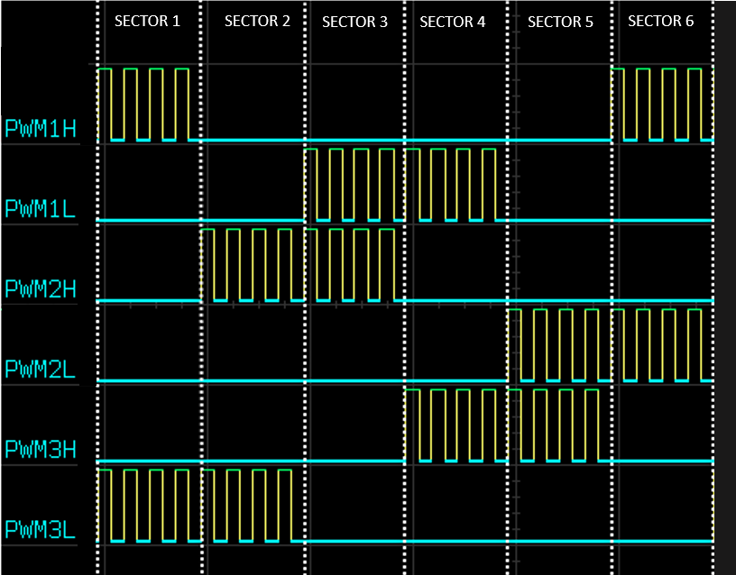

Since only one switch needs to be driven at a time on a given phase, independent PWM Output mode is used. The output override feature is used to turn off the other switches. A three-phase scheme is implemented using PWM Generator 1 (PG1) configured as Host and the other two PWM Generators
(PG2 and PG3) configured as Client. PG1 is self-triggered, whereas PG2 and PG3 are triggered from PG1’s Start-of-Cycle (SOC). Enabling PG1 will start the system in a synchronized fashion.

Configuration Summary:
- Independent Edge PWM mode
- Independent Output mode
- Master Period and Duty Cycle Used
- Override State is drive low

### 1.2 PWM Switching Scheme 2
In this PWM scheme, three switches are used to control the two active phases. In a given sector, one active phase is driven with a complementary PWM waveform and the other active phase has only its low side driven high at 100% duty cycle, as shown in figure below. Like Scheme 1, overrides are used to control the outputs in each sector.

  

  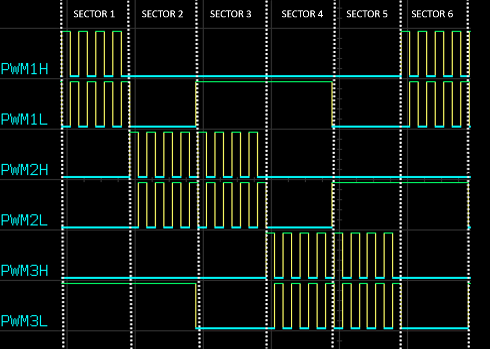

In this scheme, Complementary Output mode is used and overridden as needed in each sector. The same three-phase Host-Client synchronization technique is used as in Scheme 1. 

Configuration Summary:
- Independent Edge PWM mode
- Complementary Output mode
- Master Period and Duty Cycle Used
- Override State is Dependent on Sector State
- Dead time is applied to the Complementary PWM Signal

### 1.3 PWM Switching Scheme 3
In this PWM scheme, four switches are driven in a given sector. Two pairs of complementary PWM outputs are applied to the two active phases. The inactive phase is overriden to low as needed, as shown below.

  

  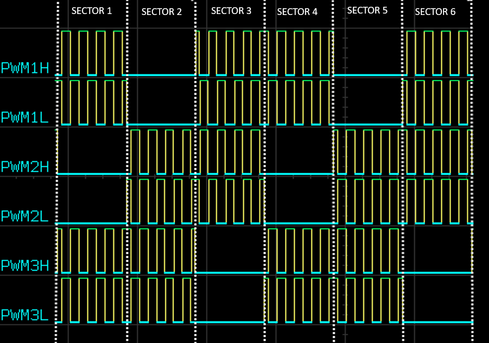

In this scheme, Center-Aligned PWM mode is used with dead time to prevent high current during switching transitions. The two active phases are driven 180 degrees out of phase to one another using the SWAP feature.

Configuration Summary:
- Center-Aligned PWM mode
- Complementary Output mode
- Master Period and Duty Cycle Used
- Override State is Dependent on Sector State
- Dead time is applied to the Complementary PWM Signal

## 2.	SUGGESTED DEMONSTRATION REQUIREMENTS
### 2.1 Application Example Firmware Required for the Demonstration
To clone or download this application firmware on GitHub, 
- Navigate to the [main page of this repository](https://github.com/microchip-pic-avr-examples/dspic33ck-curiosityboard-pwmexample-sixstep-commutation) and 
- On the tab **<> Code**, above the list of files in the right-hand corner, click Code, then from the menu, click **Download ZIP** or copy the repository URL to **clone.**

### 2.2	Software Tools Used for Testing the firmware
- MPLAB® X IDE **v6.10** 
- DFP: **dsPIC33CK-MP_DFP v1.11.346**
- MPLAB® XC16 Compiler **v2.00**

> **_NOTE:_**
>The software used for testing the model during release is listed above. It is recommended to use the version listed above or later versions for building the model.

### 2.3	Hardware Tools Required for the Demonstration
- dsPIC33CK Curiosity Development Board ([DM330030](https://www.microchip.com/en-us/development-tool/DM330030))

> **_NOTE:_**
>All items listed under this section Hardware Tools Required for the Demonstration are available at [microchip DIRECT](https://www.microchipdirect.com/).

## 3. HARDWARE SETUP

This section describes hardware setup required for the demonstration.

1. The board has an onboard programmer **'PICkit™ On Board (PKoBv4)'**, which can be used for programming or debugging the dsPIC33CK256MP508. To use the on-board programmer, connect a micro-USB cable between Host PC and Micro USB **connector J7** provided on the dsPIC33CK Curiosity Development Board. 

    

    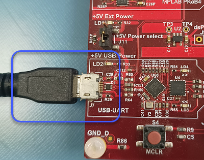
 

2. Make sure that the **Jumper J11** is on the **+5V USB Power** side to power the dsPIC33CK Curiosity Development Board from Host PC through the USB cable. 
 

    

    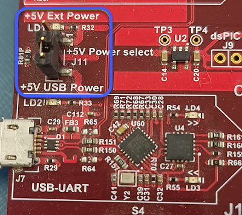

3. Connect the PWM pins RB10, RB11, RB12, RB13, RB14 and RB15 to the oscilloscope to monitor the PWM signals. 

## 4.	BASIC DEMONSTRATION

 Follow the instructions step-by-step, to set up and run the demo example:

1. Start **MPLAB X IDE** and open the project **pwm_schemes.X (File > Open Project)** with device selection **dsPIC33CK256MP508.**  
    

       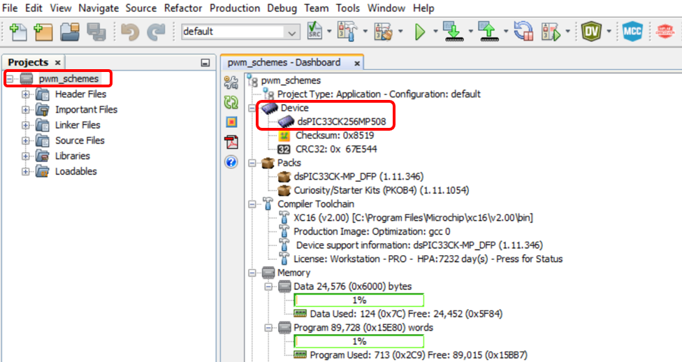

  
2. Set the project **pwm_schemes.X** as the main project by right-clicking on the project name and selecting **Set as Main Project** as shown. The project **pwm_schemes.X** will then appear in **bold.**
    

     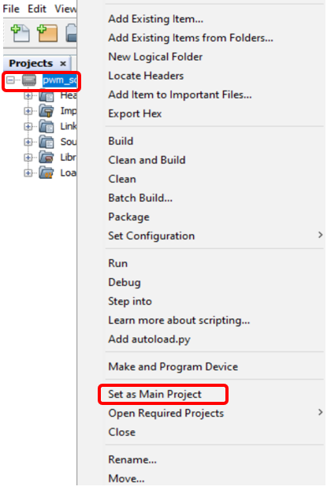

3. Right-click on the project **pwm_schemes.X** and select **Properties** to open its **Project Properties** Dialog. Click the **Conf:[default]** category to reveal the general project configuration information. The development tools used for testing the firmware are listed in section [2.2 Software Tools Used for Testing the firmware.](#22-software-tools-used-for-testing-the-firmware).

     In the **Conf:[default]** category window: 
     - Ensure the selected **Device** is **dsPIC33CK256MP508.**
     - Select the **Connected Hardware Tool** to be used for programming and debugging. 
     - Select the specific Device Family Pack (DFP) from the available list of **Packs.** In this case, **dsPIC33CK-MC_DFP 1.11.346** is selected. 
     - Select the specific **Compiler Toolchain** from the available list of **XC16** compilers. 
     In this case, **XC16(v2.00)** is selected.
     - After selecting Hardware Tool and Compiler Toolchain, Device Pack, click the button **Apply**

     Please ensure that the selected MPLAB® XC16 Compiler and Device Pack support the device configured in the firmware

     

     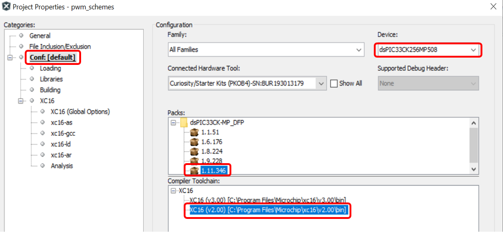

4. Ensure that the checkbox **Load symbols when programming or building for production (slows process)** is checked under the **Loading** category of the **Project Properties** window.       
        
      

      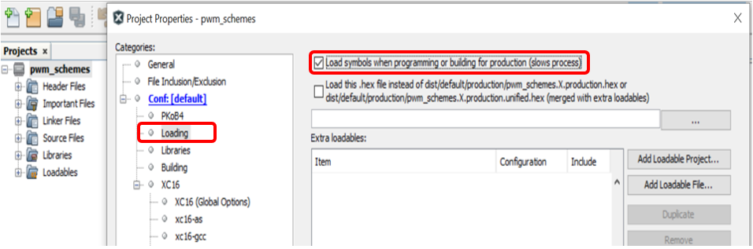

5. To build the project (in this case, **pwm_schemes.X**) and program the device dsPIC33CK256MP508, click **Make and Program Device Main project** on the toolbar
    

    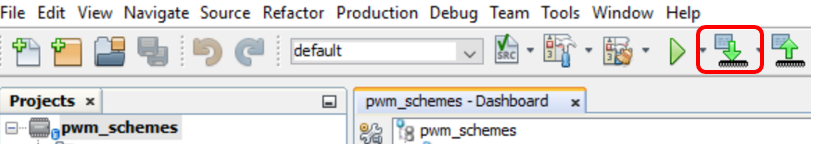

6.	
 Press the push button <b>SW1</b> to enable 'PWM Swithing Scheme 1' and 'RED LED' is turned ON to indicate it. Press the push button SW1 again to disable the PWMs.

    

      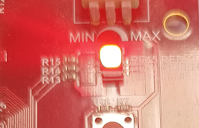
 
    

7.	
 Press the push button <b>SW1</b> to enable 'PWM Swithing Scheme 2' and 'GREEN LED' is turned ON to indicate it. Press the push button SW1 again to disable the PWMs.

    

      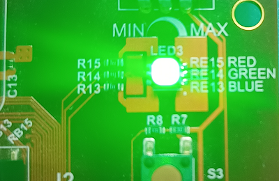

    

8.	
 Press the push button <b>SW1</b> to enable 'PWM Swithing Scheme 3' and 'BLUE LED' is turned ON to indicate it. Press the push button SW1 again to disable the PWMs.

    

      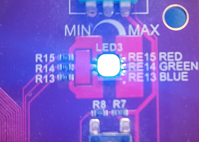

    

## 	5. REFERENCES:
For more information, refer to the following documents or links.

1. [dsPIC33CK256MP508 Family Datasheet](https://ww1.microchip.com/downloads/en/DeviceDoc/dsPIC33CK256MP508-Family-Data-Sheet-DS70005349H.pdf)
2. [dsPIC33/PIC24 High-Resolution PWM with Fine Edge Placement Family Reference Manual](http://ww1.microchip.com/downloads/en/DeviceDoc/dsPIC33-PIC24-FRM-High-Resolution-PWM-with-Fine-Edge-Placement-70005320b.pdf)
3. [dsPIC33CK Curiosity Development Board User’s Guide](https://ww1.microchip.com/downloads/aemDocuments/documents/MCU16/ProductDocuments/UserGuides/dsPIC33CK-Curiosity-Development-Board-User%27s-Guide-DS50002859A.pdf)
3.	[MPLAB® X IDE installation](https://microchipdeveloper.com/mplabx:installation)
4.	[MPLAB® XC16 Compiler installation](https://microchipdeveloper.com/xc16:installation)
